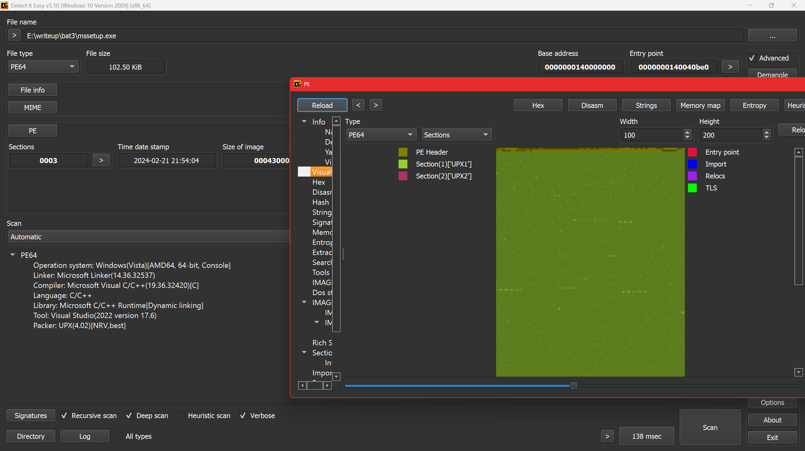
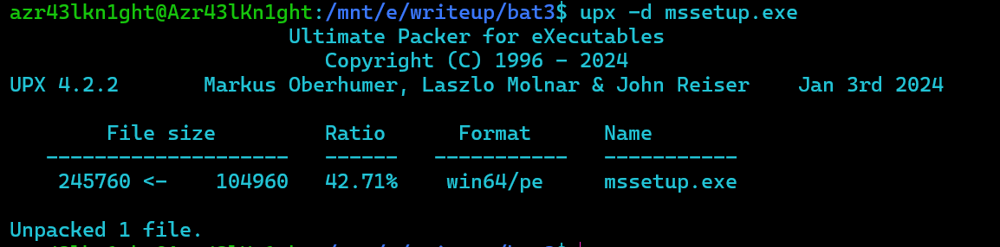
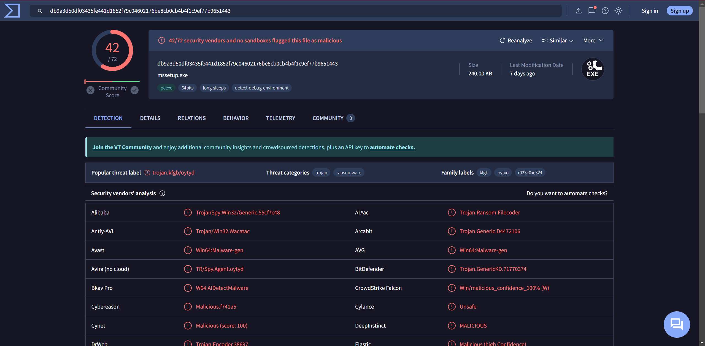
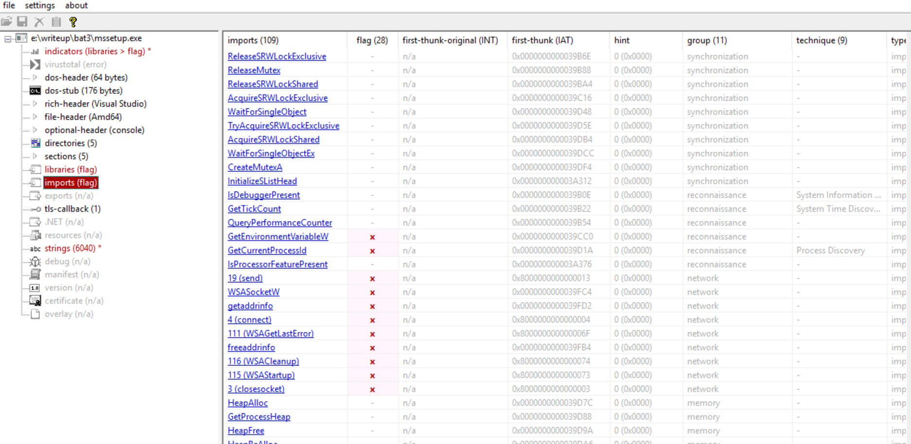

**tl;dr**
+ Challenge 2 of Batman Investigation series
+ Ransomware Investigation
+ Rust based Ransomware Analysis with process dump analysis to recover the randomly generated decryption vector and windows malware analysis
+ Recovering from a ransomware attack


<!--more-->


**Challenge Points**: 1000
**No. of solves**: 1
**Challenge Author**: [Azr43lKn1ght](https://twitter.com/Azr43lKn1ght)


# Challenge Description:

Azrael the Archangel of Vengeance has joined the batfamily after destroying the machine of St Dumas defeating face to face against his most startling foe, the undying heirophant, the first son of St Dumas. The Dumas is not completely destroyed and the heirarchy out somewhere out, Jean Paul, our Azrael has a shared workspace with Duke Thomas, The signal. St Dumas got them now by sending the weapon of azrael but we got the attack process captured by signal as he was the one who let it in unknowingly. Azrael and Signal are trying to fix things to get back whatever is lost as well not get in the clutches of the order. They should now have to safegaurd batman's files as well as their own important ones. if they get it back before Dumas knowing they are getting close to finding them to stop the order as well the birth and training of new Azraels when they are waiting for negotiation or some plan to take our protagonists with hold of the recovery shard. Can you help them to recover from the loses and find the weapon of Azrael ,so they can take down the order of the St Dumas?

File Password : **E6qK~$9pUIk0kT'3&N/Okt**

**Challenge Files**:

+ [Primary Link](https://amritauniv-my.sharepoint.com/:u:/g/personal/inctfj_am_amrita_edu/ER1nPhaT_UZCsg1DxHupEVcBbng6-vCeUZ9ptj06aDbUJg?e=HB2RZY)
+ [Mirror Link](https://www.dropbox.com/scl/fi/owrkj3du3zy8btbizm2tv/Chall_images/images.zip?rlkey=dm7lbpeabc6jtdat58mt07ze9&dl=0)
----
`Flag format: bi0sctf{...}`

We'll be starting with question 5 of the challenge cuz that's where the real reversing comes in, so the quesiton 5 is as follows

#### Question 5

Q5) What is the ip and port the malware is sending the decryption essential to?
Format: ip:port

so first let's start analysing the mssetup.exe file.




using detect it easy we can see that it is packed with upx, let's unpack it



now let's check again





now it is pretty normal with sections and imports being normal, so we can start static analysis.

# Triaging
Running file on the binary shows it’s a 64 bit PE executable


We open the binary in Detect_it_easy,


And we can clearly see it is a UPX packed binary, meaning we would have to unpack it first

Can be done using 

> upx -d mssetup.exe


Now the unpacked binary when put through DIE seems to be normal


trying strings on it we see a few intersting strings such as 


* A ransom note looking text
* 98238588864125956469313398338937
* Azr43l_README.txt
* C:\Windows\System32\winevt\Logs
* C:\Windows\PrefetchC:\Windows\Temp
* C:\Users\Public\Documents\Recent
* C:\$Recycle.BinC:\Windows\Logs
* C:\Windows\System32\config
* C:\Windows\SoftwareDistribution
* USERNAME
* C:\UsersDownloadsDesktop0_o
* AppData\Roaming\Notepad++Documents168133:


we also see strings pertaining to chacha20, giving us a small idea on what this ransomware might entail

# Static Analysis

Now we can load the binary into **IDA 8.3 Freeware**

And we find main fairly easily

### Getting to main


In a rust binary unlike the C/C++ binaries, the main is not actually a main, rather it passes the function pointer of main to another function called lang_start

### Anti Debug Check

Now heading into the actual main we see,
An IsDebuggerPresent call


So we can easily either NOP out these bytes or convert the jnz to jz as such


Now this would help us during our debugging session, if we need to step through this function

### Lastinputinfo

Next we have this block of code between lines 123 - 130


Googling for the struct LASTINPUTINFO 
 
 

As it says, we get a structure filled with the last input info


This function fills the dwTime field of the structure with the milliseconds (tick count) of the last input info. The milliseconds here are from the start of system_time

Analysing the next block of code,


### GetTickCount()

We see GetTickCount() being called


As mentioned, it returns the number of milliseconds since the system was started,
And that is being subtracted from the time the last input was taken and compared against 59999, and is evaluated true if greater. Ie it would be false if it is under 60000ms, 60000ms is 60s i.e 1 min. The malware checks if the computer was idle for the last minute, if it was idle, then it exits . This is one of the conditions


For the next block of code above, in the if condition we see it takes a fills a structure plii with the current cursor position and and then sleeps for 5 seconds, then measures the next cursor position and we can see a ‘mm_cmepeq_epi132’ , indicating a compare, thus these two measured cursor positions are compared and if it is the same then it is marked as True, at which point the malware exits and stops running as well.


Once the if condition is cleared,

in the block of code below


We see the use of a function “GetAsyncKeyState” 

### GetAsyncKeyState()


We can look up the MSDN webpage associated to GetAsyncKeyState


As it mentions, it determines which key was pressed during the latest IO operation

And we have GetAsyncKeyState(1) and GetAsyncKeyState(2)

Where args 1 and 2 correspond to : 

Under the virtual [key_code](https://learn.microsoft.com/en-us/windows/win32/inputdev/virtual-key-codes)

We also see, 


Based on this we can see it keeps track of how many times left click was registered and how many times right click was registered in the variables v1 and v2

Now we understand that the malware won’t run or proceed further until and unless a particular amount of left and right clicks have been registered which in our case in 
6 and 5 respectively

This clears out the doubt on why the malware wouldn't run under normal circumstances, and it requires a specific set of actions to be done in a certain number for it to proceed executing the malicious payload


After that we notice some basic initialization type code until line 179  (below) 


And tracking that particular offset 140002CFF0 leads us to functions which looks like a heapfree and memory allocation, all of this sounds like basic initialization. So not much use for us to actually reverse this part of the code


### sub_140023030() AKA Unkn_Func_1


has been rechanged to 

 going into the function it seems too much to sit and revers statically, I'll come back to this later and look at it dynamically
 
 ### sub_14000C1B0() AKA Get Environment Variable
 
 Next interesting function is  
 

This function seems to take an arguemnt as "USERNAME " and a hObject to output the value

Going inside the function we see it does make use of the USERNAME argument in calling the windows API


So we go with the understanding that the hObject that goes out of this is the ENV VARIABLE

### filepath setting


this block of code seems like it is reading an existing string(unk_14002D040)


at particular offsets and it is appending whatever is read from env_struct to 
parts of this string

A hunch we can easily form out of this entire code block is that it is using our system USERNAME to get the correct full path of these directorys

* C:\Users\%USER%\Downloads\
* C:\Users\%USER%\Desktop\

**sub_140011F80** mentioned here seems to be taking these

Going inside it, we see it basically has a memcpy inside it

so we aptly can rename sub_140011F80 ->concat

Also, we see the output in one is being used in the other after being put through another function sub 140018D50, which just returns the string as is, this can be hunched of as `unrwap()` in rust

**sub_140005700** just calls a freeheap within itself, so we can rename that as freehap as well

so now the cleaned up statically analysed block of code looks like 


And going by the order of the string, I would assume that it is being put to use in the same order that it is stored in 

* C:\Users\%USER%\Downloads\
* C:\Users\%USER%\Desktop\

So we can rename the above images/image to kind of fit our mental images/image of what is happening


### Ransom_note_file_name

As we can see, first 17 bytes of this offset is read in 


### Create ransom file

when went into the highlighted function, we see calls such as 


which leads us to understand that this now creates a file under the name  
`Azr43l_README.txt`. 

And we see this being used to the very last concatednated file_path, which under our assumption is `Desktop`

### Write ransom note to desktop


In the above images/image we see **sub_140004550**, we see calls to NtWriteFile


and this function by itself takes arguments to the ransom_note
hence it is safe to assume that it does write the ransom_note onto the newly created `Azr43l_README.txt`

Then after this block of code it's mostly a bunch of heap_free calls until line 252

### sub_140017EF0() AKA unkn_func_2


We see the same routine yet again and some file_path\\Azr43l_README.txt being passed as an arg to the above mnetioned func. We don't understand much from looking into this, this is yet another function to be looked at dynamically


### Ransom note drop pt.2


Starting from line 275 we see a similar routine again of it again wrting the same content to this new file, it's just that it is in a different location (which can be found out dynamically)

### sub_140001450 AKA Unkn_Func_3


Now we get to what seems to be the crux of the ransomware.
We see a new function which we have named unkn_func_2 take in the earlier unkn_func_1's output and it also takes the user_download_folder path, going into the function, it only confuses us even more, so for now we stick to just renaming it like so


### Continuing

As I continued to scroll down more, I saw a similar routine of unwrapping a string and unkn_func_3 being called on them at which point I thought, static analysis is gonna get us only so far, and that we can start looking at the file dynamically

# Traiging pt.2

Before we start with the dynamic analysis of the ransomware, it would be helpful to debug and get to code faster if we patch out these three key areas

* The anti debug check as mentioned above
* The cmp for the number of clicks both 5 and 6

Just for fun I decided to run this binary now, in a controlled environtment ofcourse to see what this does, and as expected so far, we see a ransom note in Desktop and we also see certain files gettting encrypted and being renamed as .azr43l files

for example


# Dynamic Analysis


NOTE:

> All the debugging that is being shown in this writeup has been purely done inside and isolted VM. And under no condition, should you try to replicate it on the HOST.

Now we can start with the dynamic analysis of the ransomware 

Becuase we patched out the above mentioned areas of jnb to respect jb and jz to jnz, debugging is a smooth sail

we get to the first function we wanted to look at dynamically


### sub_140023030() AKA Unkn_Func_1 AKA random_24_gen


Initially we just kept track of the output value of this function
and func_1_output seems to be generated on runtime

and when tried to run multiple times, we see different values being generated

1)


2)


3)


Looking at this we see, it generates 

* Random value
* **24 bytes**

so we can go ahead and change the name of the func to


### Get_env_Variable


Can confirm that it does take the given struct adn does return the %USER% value in the struct


### Setting Filepath
we can confirm those particular file_paths now and we do see the actual path and we can name the variables accordingly

1)


2)


3)


### Ransom_note_path

The ransom note path can also be found as shown below
`C:\Users\Ryuzaki\Desktop\Azr43l_README.txt`


### Unkn_func_2


Now we come to unkn_func_2
We see the first arg being some structure, and the second one being the desktop_ransom_note file path


We see plii return 1 at the cb.size so it doesn't even enter the block of code under the if condition below

### Unkn_func_3


Now we come to this part of the code


 as we can see, from renaming the above variables in the "setting filepath" we get an idea as to what all args are being passed into this function
namely

* file_directory_path (download folder in this case)
* file_directory_path_len (confirm from debugging)
* random_generated_val (24 bytes)


**Statically** looking at unkn_func_3 we see a lot of operations pertaining to an encryption of sorts and we see some variables named randombuffer , we see this string 
`98238588864125956469313398338937` being xorred with something


and we also see the use of the string .azr43l, as seen above in the second triaging attempt


So going based off of these hunches, now I name the current function that we are in right now, unkn_func_3 as encrypt()


## Encrypt() - the heart of the ransomware

Going into encrypt, we come across the first function which takes the file_path and the file_length as arguments, v53 being the output 


Currently in our case, the file_path is the download folder and the file_length is accordingly set.

### sub_140016D10

Going inside the above mentioned function, we see


> I have renamed some variables as differently variants of "file_path" accordingly again and again ,becuase the pointers were being copied and switched around

As we keep scrolling down, most of it seem pretty basic and normal assigning operations with nothing much being operated upon.
Until this part,


path file before that particular function call was just our downloadpath file
`C:\Users\%USER%\Downloads\`

But after that call, 


it is appended with a * like so

And in windows * is reserved and is not allowed to be used as an actual file name.

It is mostly used to search under a particular directory, a regex the means anything meatching that particular pattern of string. So rn it seems as if that function was supposed to append a * depending on whether or not the pathfile ended in a "\" character.

so we rename that function `sub_7FF792300B20` like so  


and continue ahead.


### sub_14001A640 AKA convert_to_widechar
takes our file_path as arg
and once it exits, we see this
when we track our filepath variable


hence it has been aptly named

### sub_1400194E0 AKA get_full_path_name

it takes lpfilename and our file_path as argument, and output's the fullpath name under lpfilename 

When we look inside the function we see


and stepping over this function while debugging also confirms the same. In our case it returns the same `C:\Users\Ryuzaki\Downloads\*`


Now coming to next block of code


#### FindFirstFileW


We google this on msdn and we [FindFirstFileW](https://learn.microsoft.com/en-us/windows/win32/api/fileapi/nf-fileapi-findfirstfilew)


it returns a handle to the file and an output value under the second arguemnt containing information about the file under the structure of FIND_DATAW
```c++
typedef struct _WIN32_FIND_DATAA {
  DWORD    dwFileAttributes;
  FILETIME ftCreationTime;
  FILETIME ftLastAccessTime;
  FILETIME ftLastWriteTime;
  DWORD    nFileSizeHigh;
  DWORD    nFileSizeLow;
  DWORD    dwReserved0;
  DWORD    dwReserved1;
  CHAR     cFileName[MAX_PATH];
  CHAR     cAlternateFileName[14];
  DWORD    dwFileType; // Obsolete. Do not use.
  DWORD    dwCreatorType; // Obsolete. Do not use
  WORD     wFinderFlags; // Obsolete. Do not use
} WIN32_FIND_DATAA, *PWIN32_FIND_DATAA, *LPWIN32_FIND_DATAA;
```

The key point to note is this structure contains the filename of the file that it has an info on, so our program is trying to leverage this method of finding every filename inside a given directory


SO now we can rename the args to more understandable names


Next as we keep executing, 
we see our file_info being copied into the a1 ie our arg1 which we initially thought wld be the output of this particular function as well 

And then it returns

so to summarize, 

basically this function takes a particular argument, checks if it is a directory, if it is , it would add the " * " operator at the end of the directory and calls FindFirstFileW and gets the file info based on that particular file and returns that in a struct

So we name it as as get_file_data


### Suspicious xmmword
Just looking at the assembly side by side


we see a bunch of bytes getting copied over into xmm6 and xmm7 , we just keep that in mind and go ahead

### sub_7FF7922FC850 


Not used.

### Next


While debugging we see the memcpy 2's first argument is populated with the filename from get_file_data pointer


Now in my case it turned out to be another directory that is stored first

Continuing,


we see now the if condition fails at `sub_7FF792302070`
and goes onto the else condition only to call encrypt function again recrusively


### Recursive encrypt - iteration 1


Now are are recrusively inside the encrypt function with the argument as 
`C:\Users\Ryuzaki\Downloads\DebugView`

we go through the same steps of finding the first file handle and it's details and names


For the purpose of creating this writeup I had made a dummy file under downloads directory 


and filled it with loerm ipsum content, and now that this file is taken in it passes throuhgh the above function wih no issues, I can form the hunch that the above function
`sub_7FF792302070` is to check if a particular path is a directory or not

we'll go ahead with that


### sub_7FF7922FC6F0()


passing through this function and looking at the value inside `RandomBuffer`, show's us 


`txt` - meaning the function serves it's purpose to find the extension of the loaded file.

then this extension is compared against `azr43l`


if the extension is already `azr43l` then it enters the else condition and looks for more files in the same directory

and if the extension is not the same then it enters into the if condition

This throws more light on the ransomware, that once it encrypts it's files it wld extend it with azr43l 


In the next check it makes sure it doesn;t encrypt the ransom_note.txt 


if it turns out to be the ransom note then it exits ,looking for the next file in the directory


next we see inside this unkn_func_0


we spot it's a CreateFile API

hence we name this function as create_file


then as we go down, we debug more to spot a particular function 

`sub_7FF792301E20`


That seems to return teh filename alone from the huge file path, for example in our case it is - `just_a_test_doc`


Then from further debugging we see function calls such as 

which I have renamed it, because it returns the technical last byte being "\0"


Then it takes the file_name and appends to it the .azr43l extention through these two memcpy


Next during further debuggin we notice and rename a particular function call that just returns teh current directory path that the file is in 


and that it is getting copied to `Random buffer`


Next in the subsequent lines of code


we see random buffer being appended to file_directory
there_by creating this 


basically it appends .azr43l to the path of the old filename and it creates a new file_path


### Creating Encrypted File

Now we notice it creates a new handle and opens it to the new encrypted file under the new name of 

`C:\Users\Ryuzaki\Downloads\DebugView\just_a_test_doc.txt.azr43l`


Then it's just doing a few copies of file pointers which is not really necessary for us atm


it provies a malloc space for file_contents then we finally come to reading the file

### Openfile

Opening the open_file function we see 


hence we name it to be open_file


now we can see the file contents as well


### Random_num_generator

we come across another function which only seems to take two args


opening it we see, 


    


So now we have renamed it as 


we can see the RandomBuffer is now stored on the stack


### The actual encryption


We see two function calls here 

- sub_7FF7922F8600()
and 
- sub_7FF7922F88B0()


Coming to the first one

### sub_7FF7922F8600()

```cpp
sub_7FF7922F8600(&RandomBuffer, &random_buffer, 32LL, random_24_bytes_val, 12LL)
```

The arguments it takes are :
Arg 1 and 2 RandomBuffer that we just generated right now

Arg 3 : 32
Arg4: previously generated 24 bytes random value 
Arg 5 :12 

A major point to note is that this doesn't involve our file_contents at all 

Entering inside this function, this is what it looks like


we see strings like chacha20 which certainly do pique an interest here


WE see another function being called internally

`sub_7FF7922F86C0()`

which returns the value in v10

and now v10 contains 

`expand 32-byte k`

curious on this we google and a small googling let's us know that this is the initial state of the chacha20 encryption alrogithm


Therefore now we can rename this funtion as init_chacha20

And googling more about chacha20 in rust gives us [this page](https://docs.rs/chacha20/latest/chacha20/)

in this we can clearly see that chacha makes use of a 32 byte key(which in our case is random_buffer)
and a 12 byte nonce(which in our case is the 24 byte random_val)

we keep that in mind that it takes only the top 12 bytes of this 24 byte random_val

### sub_7FF7922F88B0()

Coming to the second function, we now see


Arg1 : `expand 32-byte k` followed by the random_buffer in memory followed by the first 12 bytes of the 24_byte_val
Arg2 : file_contents
Arg3 : A number(assuming it's the size of the file)
Arg4 : unsure
Arg 5: unsure


This is arg 1:

 
 followed by 
 
 the 32 byte random value
 


followed by the 12 byte nonce


all of this is on the stack and now this aligns with what we saw in the rust documentation and hence, now we are able to get a clear picture on how and what it is encrypting

we basically have the random_val and the nonce that is needed to encrypt and decrypt in chacha20


#### Encrypted data


After encryption the location where the 12 byte nonce was stored is where the encrypted data is stored as well, the pointer is being overwritten


#### Suspicious xorring

This is pertaining to the earlier suspicious group of bytes that we saw getting pushed into xmm words


rn the very same byts that are storred in xmm8 and xmm7 are getting xorred with the 32 byte random value that we just generated


### Writing to encrypted file


This xorred value is now being appended to the very end of the file_data that we just encrypted.

This helps us recover the randomvalues that were generated for each file

Meaning, to decrypt now we have got the random_32_byte key we would only require a 12 byte nonce that needs to be used in decrypting

And right now finally as everything goes, we take the encrytped bytes and write it into the new file that we just generated with the .azr43l extension

### Delete old file


Once the new file has been written now, there is no need to keep the original old file around which is now getting deleted from the system

And the rest of this function is just clearing memory spaces and freeing the heap

And thus that brings us to the end of the encrypt function


### Out of Encrypt

After getting out of the encrypt function we continue down into the code

we see it assigning new path now, but because it follows the same routine I don't want to bloat the writeup with redundant info

### Encrypting desktop


This block of code encrypts the desktop content

### Encrypting notepad++


Then it goes onto encrypt 
`C:\Users\Ryuzaki\AppData\Roaming\Notepad++`

### Encrypting Documents


Encrypts documents twice


### SocketConnection

Now we get to the intersting part again, different from the few previous code blocks


We see here what looks like an IP addr

`192.168.1.33`

and right below we seem to have been given the port


Now hObject seems to be initialized with ip and port binding them into a single struct for sockets

as we track hObject we see it is being passed onto


which takes the IP , Port and the random_24_byte_val, which we now know to be the nonce


it sends the nonce to IP 192.168.1.33:6969

### sub_1400024B0()


And last but not least we come to the final function which is yet to be analysed


Going into the function we see it has all these strings,


and we see a bunch of function calls of the same function(sub_1400172B0) but with different strings as different args


Going into the function we see a lot of calls 

NtCreateFile
GetFileInformationByHandleEx
DuplicateHandle
GetCurrentProcess

We cld have sit and analysed all this, but to save us some time, we cld step over all this functions and go in search for those particular directoris mentioned there such as

* C:\Windows\System32\winevt\Logs
* C:\Windows\Prefetch
* C:\Windows\Temp
* C:\Users\Public\Documents\Recent
* C:\$Recycle.Bin
* C:\Windows\Logs
* C:\Windows\System32\config
* C:\Windows\SoftwareDistribution


And after analysis, it's easy to understand and to formulate a hunch that this particular funtion was meant to remove all the files inside these directories of valuable DFIR artefacts as well for anti-forensic purposes.

now as the anlysis is over , we will go ahead and answer the questions

# C2 server IP

```
192.168.1.33:6969
```
